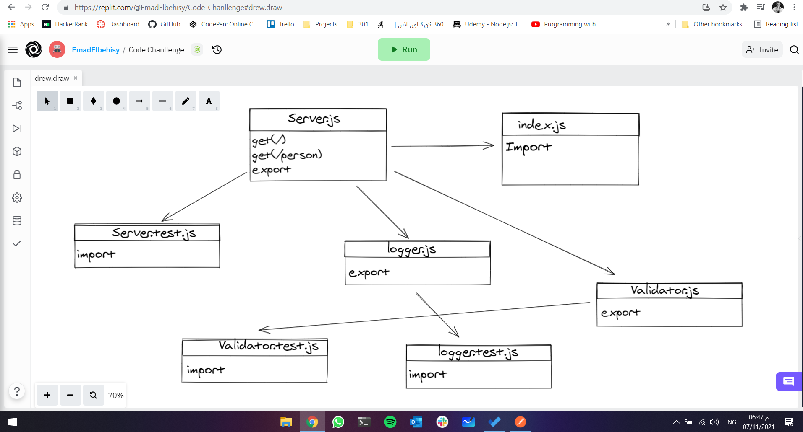

# basic-express-server

> in this class i know so many thing like 

+ middleware
+ supertest
+ workflows
+ jest

> Today the instructor gave us something new regarding the CI/CD for deploying the backend & also he gave us notes regarding the HTTP numbers (200,404,500) which are based on the website status which we implemented in the class.

 # UML
 
 

# Links
## Heroku links
main branch server: [main branch](https://basic-express-server0.herokuapp.com)

***

# Pull requests
dev to main pull request: [pull request](https://github.com/EmadIdris/basic-express-server/pull/1)
